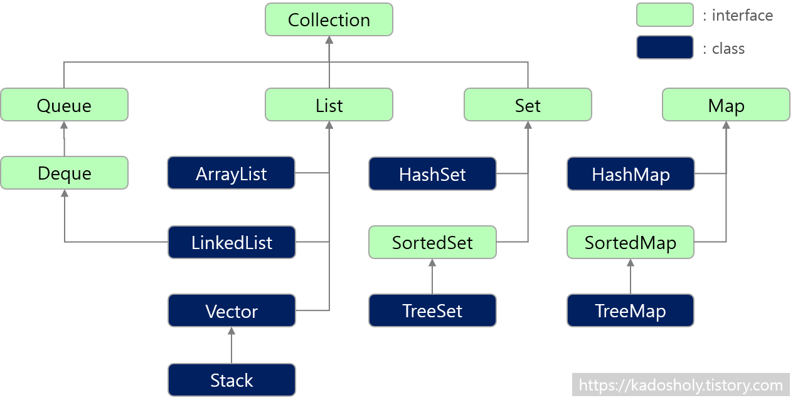

# Java Collection

## Collection
> - 많은 데이터 요소를 효율적으로 관리하기 위한 자료구조를 구현  
> - 많은 수의 데이터를 그 사용 목적에 적합한 자료구조로 묶어 하나로 그룹화한 객체  
> - 대표적으로 Arraylist, LinkedList, HashMap 등이 있습니다.
 
## Collection 맵
> 

## Collection 종류
> - List : 이름과 같이 목록처럼 데이터를 순서에 따라 관리합니다.  
> - Set : 중복이 허용되지 않는 데이터를 관리합니다.  
> - Map : 데이터를 Key와 Value로 짝을 이루어 관리하며, Key값은 중복을 허용하지 않습니다.  
> - Queue : 데이터 In / Out 순서를 FIFO 방식으로 관리합니다. (FIFO : First In First Out)  
> - Stack : 데이터 In / Out 순서를 LIFO 방식으로 관리합니다. (LIFO : Last In First Out)

## Collection 특징
> - Collection 에서 다루어지는 데이터는 일반적인 데이터 타입이 아닌 객체 형식의 데이터 타입이 들어갑니다. (Wrapper Class)   
> - Auto Boxing/Unboxing 을 지원합니다.

### 출처
https://kadosholy.tistory.com/117