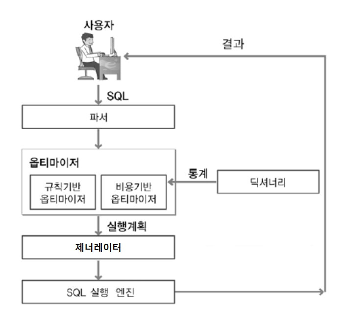

## 쿼리의 실행 절차

### 1. SQL 파싱
> - 개발자가 작성한 SQL을 SQL 파서를 이용해 옵티마이저로 파싱한다.
> - SQL 을 쪼개어 구성요소를 파악하고 이를 파싱하여 파싱트리를 생성한다.
> - SQL 문법검사의 경우 이 'SQL 파싱' 단계에서 이루어지며 문법에 이상이 없다면 파싱트리를 생성한다.

### 2. Optimization
> 파싱트리를 기반으로 다음의 동작들을 수행한다.
> - Query Transformer : 파싱된 SQL을 보고 같은 결과를 도출하는 더 나은 SQL로 변환이 가능한지 판단하여 변환한다.   가능하다고 판단되면 불필요한 조건을 제거하거나 복잡한 연산을 단순화 시키는 작업을 수행한다.
> - Estimator : 시스템 통계정보를 딕셔너리로부터 수집하여 SQL을 실행할 때 소요되는 총비용을 계산한다
> - Plan Generator : Estimator 를 통해 계산된 값들을 토대로 후보군이 되는 실행계획을 도출한다.

### 3. Generation
> 옵티마이저가 생성한 실행계획을 SQL 엔진이 실제로 수행할 수 있는 코드나 프로시저 형태로 포매팅한다.

### 4. Execution
> 포맷팅된 SQL 을 실행하고 결과를 사용자에게 전달한다.

  
출처: https://velog.io/@kwontae1313/%EC%98%B5%ED%8B%B0%EB%A7%88%EC%9D%B4%EC%A0%80